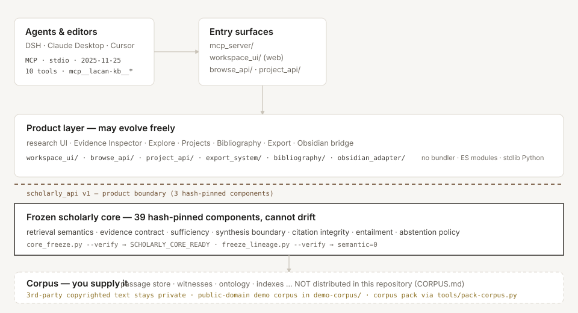
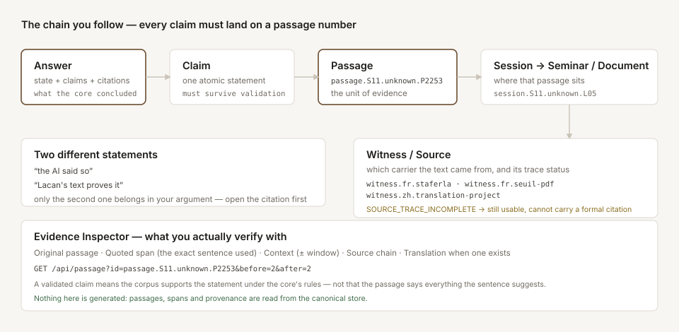
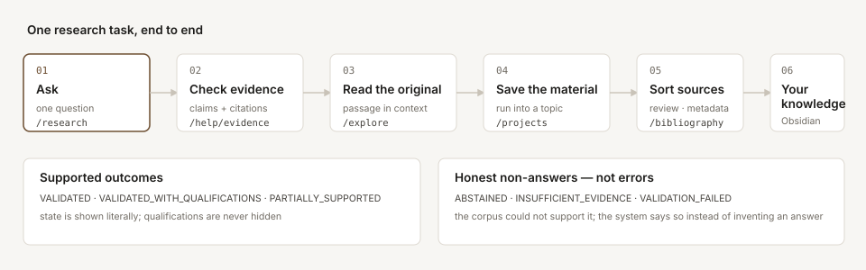

<div align="center">

# Lacan Knowledge OS

**ラカン精神分析のためのコーパス根拠型リサーチ環境。**
まず証拠、次に解釈、捏造はしない。

[English](README.md) · [中文](README.zh.md) · [**日本語**](README.ja.md) · [Français](README.fr.md) · [Deutsch](README.de.md) · [Italiano](README.it.md)

[](LICENSE)
[](docs/ARCHITECTURE.md)
[](docs/SCHOLARLY_REGRESSION_SPEC_V1.md)
[](docs/MCP_TOOL_CONTRACTS.md)
[](https://github.com/YanKaFei/Lacan-Knowledge-OS-corpus)

</div>

---

> ### このシステムが従う唯一の規則
>
> *すべての主張は、必ず一つの段落番号に着地しなければならない。*
>
> コーパスが支えられない問いに対して、システムは**棄権**します —— モデルの知識で
> 答えることはありません。**棄権は結果であり、エラーではありません。**

---

> ## ⚠️ 権利と利用範囲 —— コーパスを導入する前に必ず読んでください
>
> **エンジンはオープンソース、コーパスはそうではありません。** 別物であり、別の規則が適用されます。
>
> | | ライセンス / 状態 |
> |---|---|
> | **エンジンのソースコード**（本リポジトリ）| Apache-2.0 —— 利用・改変・再配布・商用製品への組み込みが可能 |
> | **参照コーパス**（[対応リポジトリ](https://github.com/YanKaFei/Lacan-Knowledge-OS-corpus)）| **第三者が著作権を持つテキスト。** 公開で読めますが、**研究・学習目的に限り**利用可。「公開されている」ことは許諾ではありません —— 商用利用・再配布・第三者への提供はいずれも許諾されていません。 |
> | **パブリックドメインのデモコーパス**（[`demo-corpus/`](demo-corpus)）| パブリックドメイン（Falret 1890 · Binet 1892 · Janet 1909）—— 自由に再配布可能 |
>
> **率直に言えば。** コーパスには、ラカンのセミネールの**フランス語作業転写**、**スイユ版印刷本**（S1–S5）からのテキスト抽出、
> そして**コミュニティによる中国語翻訳プロジェクト**が含まれます。これらの権利は**本プロジェクトには一切ありません**。
> 研究者が入手できるよう公開されています。そして
> **「アクセス権の付与」は「ライセンスの付与」ではありません** —— 商用利用、再配布、ミラー、転載、
> 第三者への提供、公開モデルの学習データとしての利用はいずれも許されません。
>
> **あなたの利用が適法かどうかの判断は、最終的にあなた自身が行うものです** —— 本プロジェクトは
> それを代わりに答えることはできず、法的助言でもありません。全文は [`RIGHTS.md`](RIGHTS.md)。
>
> **公開・共有・商用が可能なものをお求めなら、エンジンと「あなたが使用権を持つコーパス」を組み合わせてください** ——
> パブリックドメインのデモコーパス、ご自身のテキスト、またはライセンス済みの版。
> この道は全面的にサポートされています：[`CORPUS.md`](CORPUS.md) · [`docs/DEMO_CORPUS.md`](docs/DEMO_CORPUS.md)

---

## これは何か

**Lacan Knowledge OS** は、セミネールとエクリのテキストを**引用可能な証拠ストア**に変え、
あなたの問いと答えの間に**固定された学術コア**を置きます。



| | 機能 | 得られるもの |
|---|---|---|
| 🔎 | **Research** | 問いを投げる → コアが段落を検索し証拠契約を構築し、**その後にのみ**回答を合成。各主張は引用検証と含意検証を通過しなければならない |
| 📖 | **Explore** | コーパスを直接読む：段落・セッション・セミネール・概念・用語 —— モデルを介さない |
| 🔬 | **Evidence Inspector** | `回答 → 主張 → 段落 → セッション → セミネール → 証人/出典`、引用された**まさにその一句**と文脈ウィンドウ付き |
| 🗂️ | **Projects** | 繰り返しの実行を長期テーマに（問い・仮説・段落・人物・症例・文献）|
| 📚 | **文献と引用** | レビュー状態・メタデータ完全性・スタイル別の引用可否、**そして不可の理由** |
| ✍️ | **Obsidian ブリッジ** | 証拠と検証はこちらに。あなたの理解・ノート・執筆はあなたの vault に |

### いつでも監査できる連鎖



## やらないこと

これらの拒否は設計そのものです：

| 拒否 | 理由 |
|---|---|
| **モデルの知識で答えない** | 合成は検索された証拠のみを使える。契約が不足なら `ABSTAINED`。 |
| **出典を黙って修復しない** | `SOURCE_TRACE_INCOMPLETE` は可視のまま。隠すことは出典の誤表示。 |
| **書誌データを捏造しない** | 出版社・年・ISBN・ページは決して推測しない。出せないスタイルは理由を述べる。 |
| **自動で正典化しない** | 取り込み／AI 生成の素材は *候補* として入り、人間が昇格させるまで候補のまま。 |
| **未宣言の意味論を許さない** | 39 の学術コンポーネントはハッシュ固定。未宣言の変更は検証に失敗し、起動を**拒否**する。 |

---

## はじめかた

**AI エージェントですか？** まずこれを実行し、出力に従ってください —— 研究が動くかどうかを決める検査です：

```sh
python3 tools/ensure_corpus.py --status      # 終了コード 0 = 準備完了 · 3 = ユーザーに伝える
python3 tools/ensure_corpus.py --json        # 機械可読な状態
```

### 1 · エンジンをクローン

```sh
git clone https://github.com/YanKaFei/Lacan-Knowledge-OS.git
cd Lacan-Knowledge-OS
python3 -m workspace_ui.server.cli --port 3090
# → http://127.0.0.1:3090/help    13 ページのヘルプセンター（コーパス無しでも完全に利用可能）
```

### 2 · コーパスを与える —— 三つの道

| 道 | 得られるもの | 方法 |
|---|---|---|
| **A. 参照コーパス**（公開ダウンロード・研究利用のみ）| ラカン・セミネールの全文コーパス：1,979 ファイル · 249,105 段落 · 索引は導入後すぐ動く | 対応リポジトリ [`YanKaFei/Lacan-Knowledge-OS-corpus`](https://github.com/YanKaFei/Lacan-Knowledge-OS-corpus) → `python3 tools/ensure_corpus.py --install --pack corpus-pack-v1.tar.gz --manifest corpus-pack-v1.manifest.json` |
| **B. パブリックドメインのデモ** | 19 世紀フランス臨床文献（Falret · Binet · Janet）—— 再配布可能 | `python3 tools/build_demo_corpus.py . && python3 _scripts/_tools/build_lexical_index.py` |
| **C. 自分のテキスト** | あなたが使用権を持つ任意のテキストをエンジン付属のビルダーで取り込む | [`CORPUS.md`](CORPUS.md) · `python3 _scripts/inventory_corpus.py --help` |

**道 A の詳細。** 対応リポジトリが提供するのは**コーパスパック**です。ハッシュ・マニフェスト付きの
単一アーカイブで、`tools/fetch-corpus.py` が**ファイル単位で検証**してから導入します ——
欠けたダウンロードや改変が黙って混入することはありません。

```sh
curl -sLO https://github.com/YanKaFei/Lacan-Knowledge-OS-corpus/releases/download/corpus-v1/corpus-pack-v1.tar.gz
curl -sLO https://raw.githubusercontent.com/YanKaFei/Lacan-Knowledge-OS-corpus/main/corpus-pack-v1.manifest.json
python3 tools/fetch-corpus.py --pack corpus-pack-v1.tar.gz \
    --manifest corpus-pack-v1.manifest.json --into .
python3 _scripts/_tools/core_freeze.py --verify      # → SCHOLARLY_CORE_READY
python3 -m workspace_ui.server.cli --port 3090       # これで研究が本当に答える
```

道 A のアクセスは**個人単位**で付与され、**研究利用に限られます**（[`RIGHTS.md`](RIGHTS.md)）。
アクセスが得られなくても問題ありません：道 B / C で今日から動くシステムが手に入ります。
パックの作り方と受け渡し（公開せずに同僚へ渡す方法）は [`docs/CORPUS_PACK.md`](docs/CORPUS_PACK.md)。

### 3 · 契約を検証する（これがこのプロジェクトの要点です）

```sh
python3 _scripts/_tools/core_freeze.py --verify      # 39 の学術コンポーネント
python3 _scripts/_tools/freeze_lineage.py --verify   # 7 段階で意味論変化ゼロ
python3 _scripts/_tools/build_i18n.py --check        # UI 文言 ↔ 辞書 ↔ 呼び出し点
python3 _scripts/_tools/build_help.py --check        # Help のリンク・アンカー・捏造 0
bash _scripts/run_all_tests.sh                       # 146 スイート · 78 バリデータ
```

**要件：** Python 3.9+（コア経路は標準ライブラリのみ）とモダンブラウザ。**バンドラもビルド手順もありません** ——
`index.html` が ES モジュールを直接読み込みます。ベクトル検索と実 LLM は任意の拡張です
（[`docs/EMBEDDING_PROVIDER.md`](docs/EMBEDDING_PROVIDER.md)）。

---

## 使い方



1. **問う** —— 一度に一つの問い。
2. **状態を読む** —— `VALIDATED`、`VALIDATED_WITH_QUALIFICATIONS`、`PARTIALLY_SUPPORTED`、
   `VALIDATION_FAILED`、`INSUFFICIENT_EVIDENCE`、`ABSTAINED`。文字どおりに読むこと。
3. **検証する** —— 引用チップをクリック。Evidence Inspector が引用された一句・文脈・出典チェーンを示します。
   *回答はコアの結論であり、インスペクタはコーパスが実際に述べていることです。*
4. **深める** —— Explore で同じ段落を開いて周辺を読む。
5. **残す** —— `Add to Project`、または `Save to Obsidian`。

### インターフェース

| 場所 | 内容 |
|---|---|
| **ホーム** | タスク指向：**何をしたいですか？** —— 6 枚のタスクカード、6 段階のワークフロー、5 分間クイックスタート。入口はすべて実リンク |
| **Research** | 質問欄、Mode / Provider / Research language、回答ヘッダに**実測の来歴**（provider · モデル · 実時間 · キャッシュ · 試行回数）|
| **Explore** | 段落・セッション・セミネール・概念・用語・人物・症例 —— 読み取り専用 |
| **Evidence Inspector** | 右パネル：原文段落・引用句・文脈調整・出典チェーン・翻訳 |
| **ヘルプセンター** | `/help` —— 13 トピック、サイドバー、アンカー、前後移動、トピック検索、言語の即時切替 |
| **言語** | インターフェース言語（EN/中文）と**研究言語**は独立した設定です |

Help に現れるコントロール名はすべて実 UI から描画され、機能的主張はすべて機械検証されます：
**42/42 検証済み · 捏造 0 · 壊れたリンク 0**。

---

## DSH / 任意の MCP クライアントから使う

このリポジトリは**それ自体が** [DeepSeek Harness](https://github.com/deepseek-ai) のプラグイン対象です：
MCP サーバー、貼るだけの row、インストール可能なバンドル、冪等なインストーラを同梱します。

```sh
dsh plugin --profile web add github:YanKaFei/Lacan-Knowledge-OS
python3 tools/install-dsh-row.py --profile web     # サーバーパスを自分の clone に束ねる
python3 _scripts/_tools/lacan-kb-mcp               # あるいは MCP サーバー単体で起動
```

ツール名は `mcp__lacan-kb__search_passages`、`…get_passage`、`…get_context`、`…resolve_entity`、
`…list_concepts`、`…search_terminology`、`…compare_concepts`、`…find_relation`、`…list_seminars`、
`…get_sources` —— **10 ツール**、プロトコル `2025-11-25`。DSH 自身の MCP SDK で証明済み
（`_data/mcp/DSH_CLIENT_PROOF.json`、**14/14**）。詳細は [`docs/DSH_PLUGIN.md`](docs/DSH_PLUGIN.md)。

---

## 長所と短所

<table>
<tr><th width="50%">✅ 長所</th><th width="50%">⚠️ 短所・限界</th></tr>
<tr valign="top"><td>

**流暢さより検証可能性。** 各主張は段落 ID に結び付き、人間が手で監査できます。

**正直な失敗。** 棄権・`INSUFFICIENT_EVIDENCE`・明示的な利用不可が一等の出力。捏造の埋め草はありません。

**実行可能な契約。** 39 コンポーネントの固定と 7 段の系譜は、文書の約束ではなくコードが検査します。

**オフライン優先。** `Offline / Mock` は資格情報もネットワークも不要で、決定的な回答を返します。

**一つの契約、複数のクライアント。** 同じ MCP 面が Web UI・DSH・MCP 対応エディタに奉仕します。

**監査可能な履歴。** 各実行は不変スナップショット。同じ問いを再実行すると旧項目を上書きせず新項目が増えます。

**コーパスは分離可能。** エンジンは公開（Apache-2.0）、コーパスは第三者 material で独自の境界を持ち、または自前 —— 混ざらないため、
一方のライセンスが他方に波及しません。

</td><td>

**使用権のあるコーパスが必要です。** 素の状態で見えるのは UI・ヘルプセンター・契約のみ。
回答はコーパスを導入して初めて可能になります。参照パックは公開ダウンロードですが**研究利用のみ**の資料です。

**参照コーパスは研究資料であり、製品資産ではありません。** 商用利用・再配布は不可 —— [`RIGHTS.md`](RIGHTS.md)。

**範囲に主張があります。** *コーパスについて*答えます。出版史・出席者・日付の問いは棄権します
（コーパスがそのメタデータを持たないため）。

**品質スコアはありません。** どこにも「信頼度 %」はなく、解釈の質はあなたの判断です。

**ノート PC 規模には重め。** 参照コーパスは派生索引を含め約 2.5 GB。

**ベクトル検索は任意。** embedding 依存が無い場合、語彙検索に退避します（UI がどちらかを表示）。

**実 LLM 合成は単一のブロッキング呼び出し。** 長い実行は 45〜60 秒。UI は実経過時間を表示し、
「待機を中止」はバックエンド処理を取消しません。

**製品は速く、学術層は固定。** 便利機能は頻繁に変わりますが、*意味論*の変更には正式な
Core Change Request が必要です。

**領域の予備知識を前提とします。** ラカンを教えてくれるシステムではありません。

</td></tr>
</table>

---

## ドキュメント一覧

| ドキュメント | 内容 |
|---|---|
| [`RIGHTS.md`](RIGHTS.md) | **権利と許容される利用の全文** —— エンジンとコーパスの別、アクセスが与えるもの／与えないもの |
| [`NOTICE`](NOTICE) | 同じ境界を、配布者が必要とする形式で |
| [`AGENTS.md`](AGENTS.md) | 本リポジトリで AI が守る規則 —— 最初の一条はコーパスの確認 |
| [`corpus.json`](corpus.json) | 機械可読なコーパス参照：場所・導入方法・欠けている場合の手順 |
| [`CORPUS.md`](CORPUS.md) | 自前コーパスの導入：ビルダーが期待する形式 |
| [`docs/DEMO_CORPUS.md`](docs/DEMO_CORPUS.md) | パブリックドメインのデモコーパスと残るオントロジー工程 |
| [`docs/CORPUS_PACK.md`](docs/CORPUS_PACK.md) | 公開せずにコーパスを梱包して受け渡す |
| [`docs/PUBLIC_EDITION.md`](docs/PUBLIC_EDITION.md) | 本公開リポジトリの生成と否定的検証 |
| [`docs/ARCHITECTURE.md`](docs/ARCHITECTURE.md) · [`docs/MCP_ARCHITECTURE.md`](docs/MCP_ARCHITECTURE.md) | 階層と MCP 面 |
| [`docs/DAILY_USE_GUIDE.md`](docs/DAILY_USE_GUIDE.md) · [`docs/USER_GUIDE.md`](docs/USER_GUIDE.md) | 日々の操作 |
| [`CONTRIBUTING.md`](CONTRIBUTING.md) · [`SECURITY.md`](SECURITY.md) · [`CHANGELOG.md`](CHANGELOG.md) | 参加方法・資格情報の規律・変更履歴 |

## 状態

- **学術コア**：v1 で固定 —— `SCHOLARLY_CORE_READY`、39 のハッシュ固定コンポーネント、意味論ドリフト **0**。
- **製品層**：日常利用に必要な機能を備えています。直近の受入は **20/20 の阻断項目通過**、
  **146 スイート / 78 バリデータ / 失敗 0 / スキップ 0**。
- **配布**：エンジン公開（Apache-2.0）· 参照コーパス公開・**研究利用のみ** · パブリックドメインのデモコーパス進行中。
- **ロードマップ**：[`docs/ROADMAP.md`](docs/ROADMAP.md)。

<div align="center">

コード：[Apache-2.0](LICENSE) · ソーステキスト：**配布しません・商用利用は許諾されていません**（[`RIGHTS.md`](RIGHTS.md)）

*このシステムが引用確認の一週間を節約したなら、それは仕事を果たしています。*

</div>
